# CS-358 - Making Intelligent Things 2025 Spring

## Project: TurboSLAM - Fast Autonomous Car using Simultaneous Localization and Mapping

## Contributors
- Vincent Palma
- Loris Baldisserotto
- Ivan Dylevskiy
- Ilian Changkakoti
- Sarah Lim

[Google Doc](https://docs.google.com/document/d/1Hz-CrI_mGBuuY4Cr6uao3CeAetyIk8hIU1p6bzpezqY/edit?usp=sharing)

[Project Proposal](https://www.overleaf.com/read/mtyzjbnkwfxt#540f41)

## Project Overview
This project aims to develop an autonomous system for Simultaneous Localization and Mapping (SLAM) using a 2D LiDAR sensor mounted on a servo motor. The system is designed to map an environment and navigate to given coordinates while avoiding obstacles. The project is based on modifying a **Tamiya Blitzer Beetle** RC car, replacing its original control system with an ESP32 microcontroller.

## Table of Contents
- [Description](#description)
- [User Stories](#user-stories)
- [Component List](#component-list)
- [First Idea of the Mechanical Build](#first-idea-of-the-mechanical-build)
- [How to Assemble](#how-to-assemble)
- [How to Run](#how-to-run)
- [Software](#software)
- [Expected Challenges & Solutions](#expected-challenges--solutions)
- [Evaluation Metrics](#evaluation-metrics)
- [Bill of Materials](#bill-of-materials)

## Description
The system consists of two main phases:

1. **Mapping Phase:** The robot explores the environment while the LiDAR sensor scans at multiple angles using a servo motor, creating a 3D map from 2D slices.

2. **Navigation Phase:** The system autonomously moves towards a user-specified target, avoiding dynamic obstacles in real-time.

The **ESP32** microcontroller handles remote communication and data processing, making the project a cost-effective solution for indoor and outdoor navigation applications.

## User Stories

### 1. Assisting Visually Impaired Users in Indoor Navigation
**As a** visually impaired person,  
**I want** a robot that maps my surroundings and detects obstacles,  
**So that** I can navigate safely without colliding or falling.

### 2. Helping People with Mobility Issues
**As a** wheelchair user,  
**I want** a system that detects floor hazards like stairs,  
**So that** I can navigate safely.

### 3. Obstacle Avoidance for Robotic Vacuums
**As a** homeowner,  
**I want** my robotic vacuum to avoid furniture and stairs,  
**So that** it can clean efficiently without getting stuck.

### 4. Indoor Navigation for Large Buildings
**As a** visitor in a shopping mall,  
**I want** a 3D-mapping system to guide me,  
**So that** I can reach my destination without external help.

### 5. Search and Rescue in Disaster Areas
**As a** rescue worker,  
**I want** a robotic system that maps collapsed buildings,  
**So that** I can locate survivors safely.

## Component List
| Component | Info |
|-----------|------|
| Tamiya Blitzer Beetle | [Manual](https://www.tamiyausa.com/media/files/58502ml-829-5367.pdf) |
| RPLIDAR C1 | [Datasheet](https://d229kd5ey79jzj.cloudfront.net/3157/SLAMTEC_rplidar_datasheet_C1_v1.0_en.pdf), [SDK](https://github.com/Slamtec/rplidar_sdk), [Wiki](https://www.waveshare.com/wiki/RPLIDAR_C1) |
| ESP32-S3 Microcontroller (x2) | [Datasheet](https://cdn-shop.adafruit.com/product-files/5477/esp32-s3_datasheet_en.pdf) |
| DMS15 Servo (x2) | [Wiki](https://wiki.dfrobot.com/DSS-M15S_270%C2%B0_15KG_DF_Metal_Servo_with_Analog_Feedback_SKU__SER0044) |
| BNO086 IMU | [Product Page](https://www.bastelgarage.ch/bno055-capteur-intelligent-a-9-axes?search=9dof), [Datasheet](https://cdn-shop.adafruit.com/datasheets/BST_BNO055_DS000_12.pdf)|
| AS5600 Encoder | [Datasheet](https://files.seeedstudio.com/wiki/Grove-12-bit-Magnetic-Rotary-Position-Sensor-AS5600/res/Magnetic%20Rotary%20Position%20Sensor%20AS5600%20Datasheet.pdf) |
| HC-SR04 Ultrasonic sensor | [Datasheet](https://handsontec.com/dataspecs/sensor/SR-04-Ultrasonic.pdf) |
| NEO-6M-V2 GPS | [Datasheet](https://content.u-blox.com/sites/default/files/products/documents/NEO-6_DataSheet_%28GPS.G6-HW-09005%29.pdf) |
| 7.2V Battery | [Product Page](https://www.galaxus.ch/fr/s5/product/gens-ace-modelisme-dune-batterie-720-v-5000-mah-batterie-rc-9459930) |
| LM2596 Buck converter | [Datasheet](https://www.ti.com/lit/ds/symlink/lm2596.pdf) |

## First Idea of the Mechanical Build
The original car chassis was unsuitable for mounting sensors, so we built a three-layer structure:

### Base Layer: Chassis
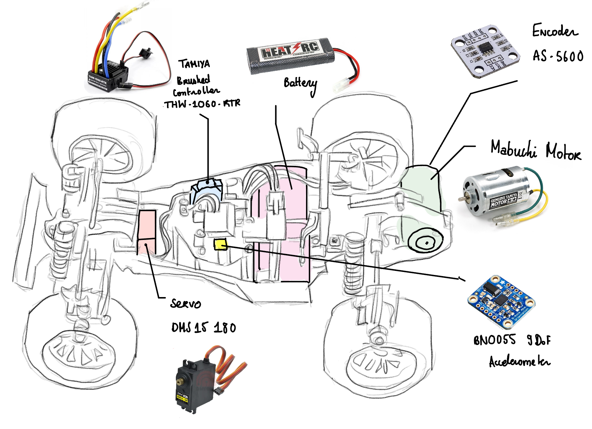

### Middle Layer: Microcontroller & Electronics Mount
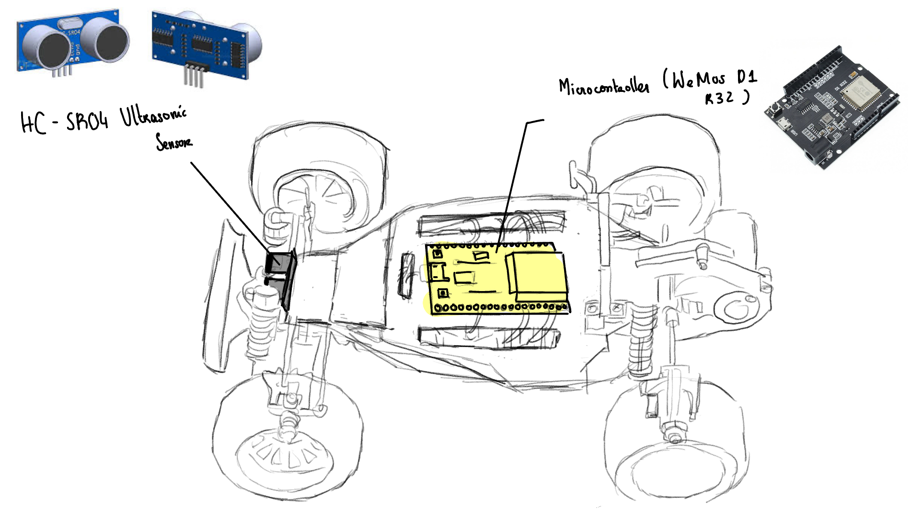

### Top Layer: LiDAR Mount (Servo-tilted 2D LiDAR for 3D mapping)
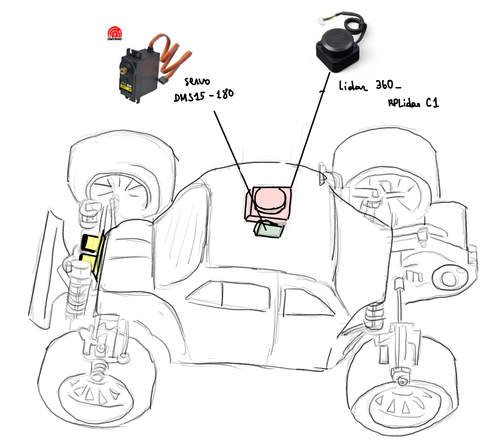

## How to Assemble

### STEP 1/8: Build the Car
Since we ordered the car, we don't have to make all its components by ourselves, but rather simply put everything together. To do this, we follow the instructions from the [Tamiya Blitzer Beetle manual](https://www.tamiyausa.com/media/files/58502ml-829-5367.pdf). The goal here is to have the minimal mechanical build, so that it can at least drive. Therefore, we should skip the carcass section and we will probably never need it at all, as it will be more of a problem than anything. The carcass doesn't have a flat surface for the lidar mount. Instead, we are going to use the layer platform, where most of the components will be mounted.

At this stage, the first servo motor for steering and the battery are mounted inside the chassis. From now on, the main part will be to attach the mounts for different sensors and actuators. All the pieces to 3D-print are available in the design/3d_files folder.

### STEP 2/8: Layer Platform
This is the basis for most of our components, including the lidar mount. The photo is *outdated*, but the CAD is the final version. We had to change the holes a few times, because we were changing sensors throughout the semester.

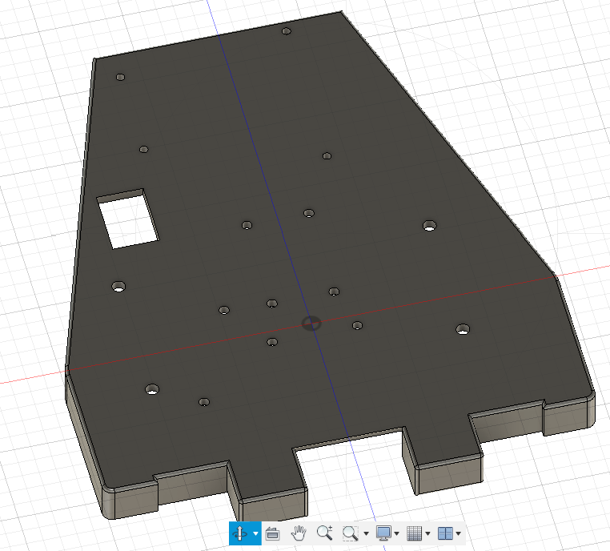
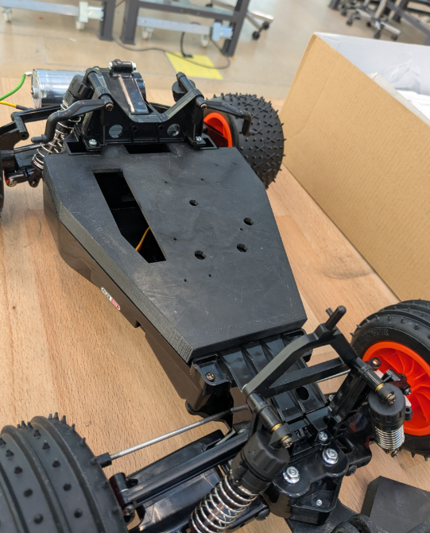

After fixing it to the car, the servo for the steering will stay inside. Make sure to bring out its cables through the rectangular hole, so that later it can be connected to the microcontroller.

### STEP 3/8: Microcontroller Mount
We decided to use **two microcontrollers** for efficiency.

  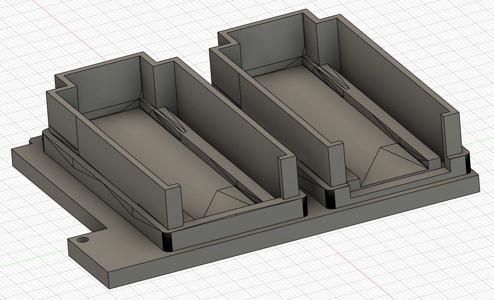
  

### STEP 4/8: Ultrasonic Sensor Mount

### STEP 5/8: Encoder Mount

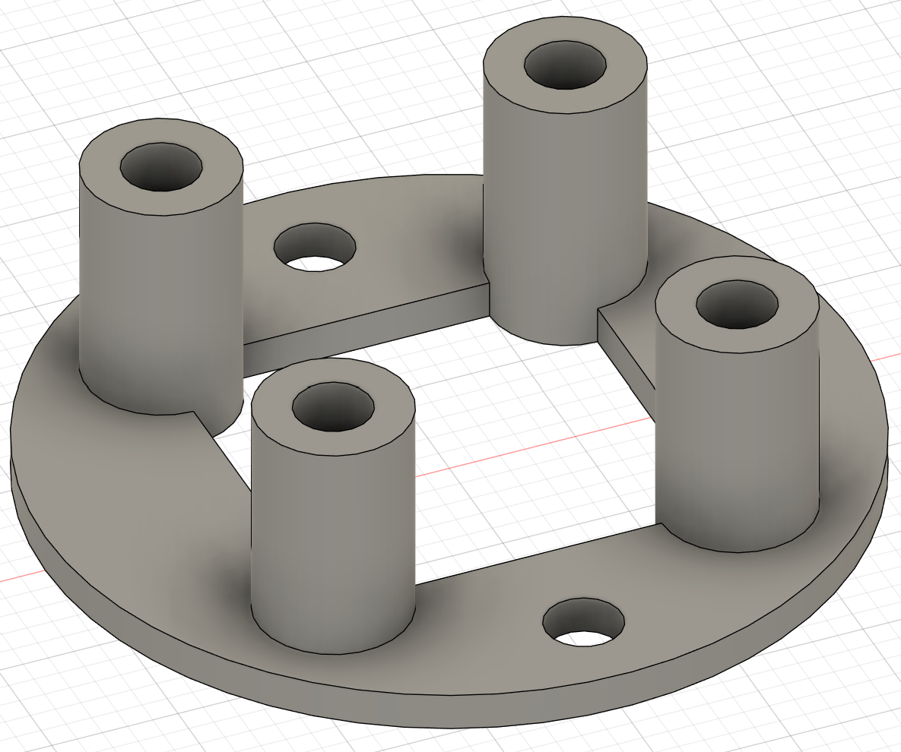
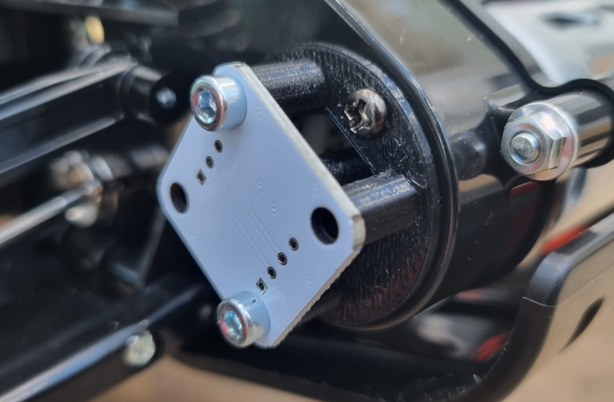

### STEP 6/8: LiDAR Mount
As we explained earlier, the LiDAR is going to be tilted for the 3D scan. This mount will make it easy to do. It consists of two walls and a tilting platform in between:

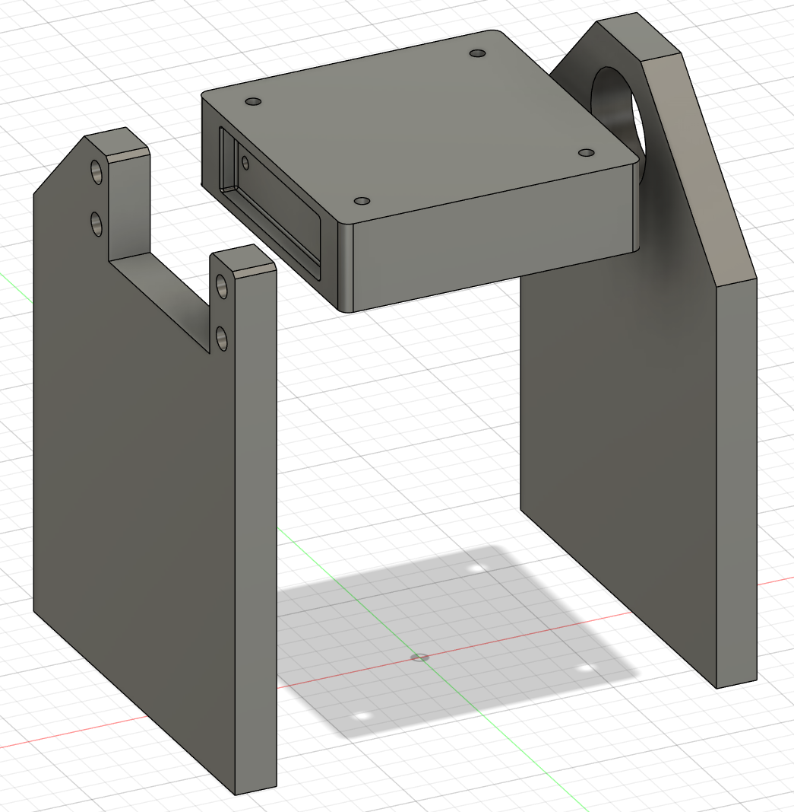  

On the left wall, the servo motor will move the platform. For the right wall, we'll need some additional pieces from the mechanical workshop to provide more stability:
- **M6 Ball bearing** (6 x 22 x 7mm)
- **M6 Screw** (35mm)
- **M6 Washer** (6.4 x 12 x 1.6mm)
- **M6 Locknut** (8mm width)
- **M6 Threaded insert** (8.7mm diameter, 12.7mm length)

To assemble these small pieces:
- Put the **screw** inside the **bearing**
- On the other side, insert the **washer**, then the **locknut**
- **Press fit** the bearing into the right wall (the hole might be a bit too small after the printing, so it needs to be filed first)
- Insert the **threaded insert** into the tilting platform on the right side

Now, both walls with the servo and the bearing can be attached to the tilting platform:

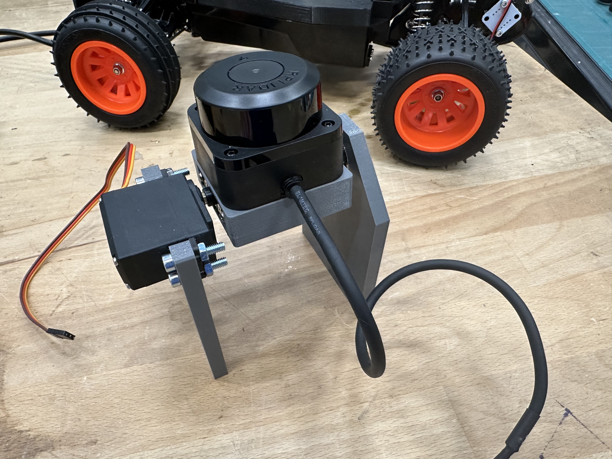

### STEP 7/8: Attach all the Remaining Mounts
Screw most of the sensors/mounts to the layer platform as shown on this image:

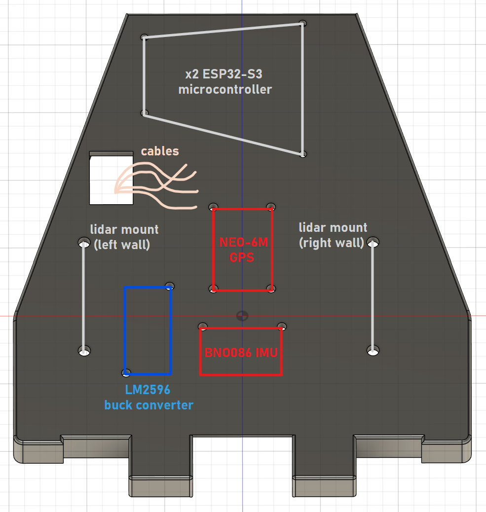

Most of them use M3 screws.

This is what it should look like:

### STEP 8/8: Wiring
Follow the wiring from this circuit diagram:

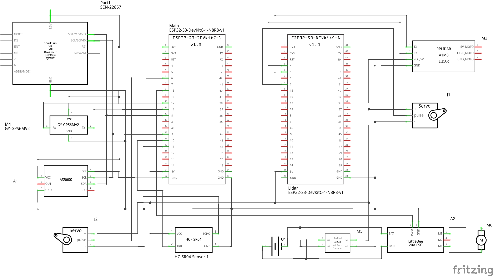

Most of our components operate at 5V, while our battery is 7.2V, so we need a buck converter to lower the voltage.

## Software
- SLAM Algorithm Implementation
- Real-time WiFi Communication via ESP32
- Path Planning & Obstacle Avoidance
- Data Processing & Visualization

## Expected Challenges & Solutions

### 1. **Building a Custom Chassis**
**Issue:** The original car body was impractical for mounting components.
**Solution:** We modified a **Tamiya Blitzer Beetle**, which offers an accessible and stable platform.

### 2. **Simulating a 3D LiDAR with a 2D Sensor**
**Issue:** 3D LiDARs are expensive and out of budget.
**Solution:** We mounted a **2D LiDAR on a servo motor**, allowing it to scan at different angles to simulate a 3D scan.

### 3. **Detecting Unexpected Obstacles**
**Issue:** Mapping alone does not detect obstacles appearing after the initial scan.
**Solution:** We implemented a **front-mounted laser sensor** for real-time obstacle detection.

### 4. **Remote Communication & Control**
**Issue:** The system lacked a remote control and radar detector.
**Solution:** We used an **ESP32 microcontroller** for **WiFi-based remote communication**.

## Evaluation Metrics

### 1. **Navigation Precision & Path Efficiency**
- **Metric:** Deviation from planned path (cm/m)
- **Measurement:** Compare actual vs. planned path using positional tracking

### 2. **WiFi Communication Latency**
- **Metric:** Transmission delay (ms)
- **Measurement:** Timestamp logs for command transmission and execution

### 3. **Battery Life & Power Efficiency**
- **Metric:** Continuous runtime before recharge
- **Measurement:** Track time in mapping and navigation modes

## Bill of Materials
| Category | Quantity | Cost (CHF) | Info |
|----------|----------|------------|------|
| Tamiya Blitzer Beetle | 1 | 129 | [Manual](https://www.tamiyausa.com/media/files/58502ml-829-5367.pdf) |
| RPLIDAR C1 | 1 | 79.90 | [Datasheet](https://d229kd5ey79jzj.cloudfront.net/3157/SLAMTEC_rplidar_datasheet_C1_v1.0_en.pdf), [SDK](https://github.com/Slamtec/rplidar_sdk), [Wiki](https://www.waveshare.com/wiki/RPLIDAR_C1) |
| Wemos D1-R32 Microcontroller | 1 | 4.0 |  |
| DMS15 Servo | 2 | 5.0 | [Wiki](https://wiki.dfrobot.com/DSS-M15S_270%C2%B0_15KG_DF_Metal_Servo_with_Analog_Feedback_SKU__SER0044) |
| BNO055 9DoF IMU | 1 | 19.90 | [Product Page](https://www.bastelgarage.ch/bno055-capteur-intelligent-a-9-axes?search=9dof), [Datasheet](https://cdn-shop.adafruit.com/datasheets/BST_BNO055_DS000_12.pdf)|
| AS5600 Encoder | 1 | 3.90 | [Datasheet](https://files.seeedstudio.com/wiki/Grove-12-bit-Magnetic-Rotary-Position-Sensor-AS5600/res/Magnetic%20Rotary%20Position%20Sensor%20AS5600%20Datasheet.pdf) |
| HC-SR04 Ultrasonic sensor | 1 | 2.0 | [Datasheet](https://handsontec.com/dataspecs/sensor/SR-04-Ultrasonic.pdf) |
| NEO-6M-V2 GPS | 1 | 13.50 | [Datasheet](https://content.u-blox.com/sites/default/files/products/documents/NEO-6_DataSheet_%28GPS.G6-HW-09005%29.pdf) |
| 7.2V Battery | 1 | 23.90 (+ 5.0) | [Product Page](https://www.galaxus.ch/fr/s5/product/gens-ace-modelisme-dune-batterie-720-v-5000-mah-batterie-rc-9459930) |

Note that this is not our final component list, but rather what we ordered at the beginning of the project. You can find the final list in the [Component List](#component-list).

## Related Projects
- [Laser Scan to Point Cloud](https://github.com/carlosmccosta/laserscan_to_pointcloud?tab=readme-ov-file)
- [ESP32 with ESC Controller](https://github.com/Tales-sv/Esp32-ESC_Controler)
- [LiDAR-Based SLAM](https://github.com/w111liang222/lidar-slam-detection)
- [SLAM Using 2D LiDAR](https://github.com/meyiao/LaserSLAM)

---
**MIT - Spring 2025**

