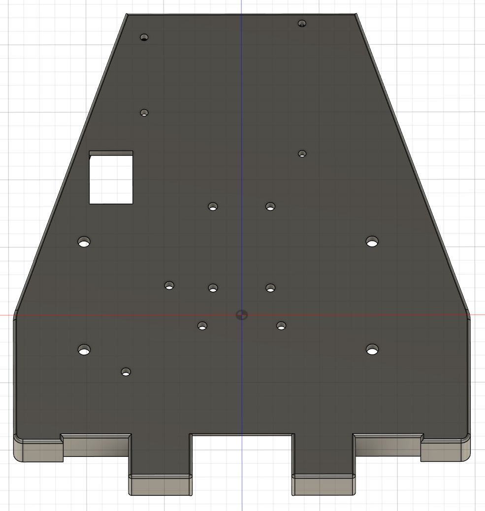

# CS-358 - Making Intelligent Things 2025 Spring

## Project: TurboSLAM - Fast Autonomous Car using Simultaneous Localization and Mapping

## Contributors

- Vincent Palma
- Loris Baldisserotto
- Ivan Dylevskiy
- Ilian Changkakoti
- Sarah Lim

[Google Doc](https://docs.google.com/document/d/1Hz-CrI_mGBuuY4Cr6uao3CeAetyIk8hIU1p6bzpezqY/edit?usp=sharing)

[Project Proposal](https://www.overleaf.com/read/mtyzjbnkwfxt#540f41)

## Project Overview

This project aims to develop an autonomous system for Simultaneous Localization and Mapping (SLAM) using a 2D LiDAR sensor mounted on a servo motor. The system is designed to map an environment and navigate to given coordinates while avoiding obstacles. The project is based on modifying a **Tamiya Blitzer Beetle** RC car, replacing its original control system with an ESP32 microcontroller.

## Table of Contents

- [Description](#description)
- [User Stories](#user-stories)
- [Component List](#component-list)
- [First Idea of the Mechanical Build](#first-idea-of-the-mechanical-build)
- [How to Assemble](#how-to-assemble)
- [How to Run](#how-to-run)
- [Software](#software)
- [Expected Challenges & Solutions](#expected-challenges--solutions)
- [Evaluation Metrics](#evaluation-metrics)
- [Bill of Materials](#bill-of-materials)

## Description

The system consists of two main phases:

1. **Mapping Phase:** The robot explores the environment while the LiDAR sensor scans at multiple angles using a servo motor, creating a 3D map from 2D slices.

2. **Navigation Phase:** The system autonomously moves towards a user-specified target, avoiding dynamic obstacles in real-time.

The **ESP32** microcontroller handles remote communication and data processing, making the project a cost-effective solution for indoor and outdoor navigation applications.

## Component List

| Component                     | Info                                                                                                                                                                                               |
| ----------------------------- | -------------------------------------------------------------------------------------------------------------------------------------------------------------------------------------------------- |
| Tamiya Blitzer Beetle         | [Manual](https://www.tamiyausa.com/media/files/58502ml-829-5367.pdf)                                                                                                                               |
| RPLIDAR C1                    | [Datasheet](https://d229kd5ey79jzj.cloudfront.net/3157/SLAMTEC_rplidar_datasheet_C1_v1.0_en.pdf), [SDK](https://github.com/Slamtec/rplidar_sdk), [Wiki](https://www.waveshare.com/wiki/RPLIDAR_C1) |
| ESP32-S3 Microcontroller (x2) | [Datasheet](https://cdn-shop.adafruit.com/product-files/5477/esp32-s3_datasheet_en.pdf)                                                                                                            |
| DMS15 Servo (x2)              | [Wiki](https://wiki.dfrobot.com/DSS-M15S_270%C2%B0_15KG_DF_Metal_Servo_with_Analog_Feedback_SKU__SER0044)                                                                                          |
| BNO086 IMU                    | [Datasheet](https://docs.sparkfun.com/SparkFun_VR_IMU_Breakout_BNO086_QWIIC/assets/component_documentation/BNO080_085-Datasheet_v1.16.pdf)                                                         |
| AS5600 Encoder                | [Datasheet](https://files.seeedstudio.com/wiki/Grove-12-bit-Magnetic-Rotary-Position-Sensor-AS5600/res/Magnetic%20Rotary%20Position%20Sensor%20AS5600%20Datasheet.pdf)                             |
| HC-SR04 Ultrasonic sensor     | [Datasheet](https://handsontec.com/dataspecs/sensor/SR-04-Ultrasonic.pdf)                                                                                                                          |
| NEO-6M-V2 GPS                 | [Datasheet](https://content.u-blox.com/sites/default/files/products/documents/NEO-6_DataSheet_%28GPS.G6-HW-09005%29.pdf)                                                                           |
| 540J Motor                    | [Datasheet](https://asset.conrad.com/media10/add/160267/c1/-/en/001385115DS01/adatlap-1385115-540-es-motor-reely-532114c.pdf)                                                                      |
| THW-1060-RTR ESC              | [Datasheet](https://www.hobbywing.com/en/uploads/file/20221015/f60b7ebe160a7b283927ae8916d36763.pdf)                                                                                               |
| LM2596 Buck converter         | [Datasheet](https://www.ti.com/lit/ds/symlink/lm2596.pdf)                                                                                                                                          |
| 7.2V Battery                  | [Product Page](https://www.galaxus.ch/fr/s5/product/gens-ace-modelisme-dune-batterie-720-v-5000-mah-batterie-rc-9459930)                                                                           |

## First Idea of the Mechanical Build

The original car chassis was unsuitable for mounting sensors, so we built a three-layer structure:

### Base Layer: Chassis


### Middle Layer: Microcontroller & Electronics Mount


### Top Layer: LiDAR Mount (Servo-tilted 2D LiDAR for 3D mapping)


## How to Assemble

### STEP 1/8: Build the Car

Since we ordered the car, we don't have to make all its components by ourselves, but rather simply put everything together. To do this, we follow the instructions from the [Tamiya Blitzer Beetle manual](https://www.tamiyausa.com/media/files/58502ml-829-5367.pdf). The goal here is to have the minimal mechanical build, so that it can at least drive. Therefore, we should skip the carcass section and we will probably never need it at all, as it will be more of a problem than anything. The carcass doesn't have a flat surface for the lidar mount. Instead, we are going to use the layer platform, where most of the components will be mounted.

At this stage, the first servo motor for steering and the battery are mounted inside the chassis. From now on, the main part will be to attach the mounts for different sensors and actuators. All the pieces to 3D-print are available in the design/3d_files folder.

### STEP 2/8: Layer Platform

This is the basis for most of our components, including the lidar mount. The photo is _outdated_, but the CAD is the final version. We had to change the holes a few times, because we were changing sensors throughout the semester.

<div>


</div>

After fixing it to the car, the servo for the steering will stay inside. Make sure to bring out its cables through the rectangular hole, so that later it can be connected to the microcontroller.

### STEP 3/8: Microcontroller Mount

We decided to use **two microcontrollers** for efficiency.

<div>
  
  
</div>

### STEP 4/8: Ultrasonic Sensor Mount


### STEP 5/8: Encoder Mount

<div>


</div>

### STEP 6/8: LiDAR Mount

As we explained earlier, the LiDAR is going to be tilted for the 3D scan. This mount will make it easy to do. It consists of two walls and a tilting platform in between:

 <br>

On the left wall, the servo motor will move the platform. For the right wall, we'll need some additional pieces from the mechanical workshop to provide more stability:

- **M6 Ball bearing** (6 x 22 x 7mm)
- **M6 Screw** (35mm)
- **M6 Washer** (6.4 x 12 x 1.6mm)
- **M6 Locknut** (8mm width)
- **M6 Threaded insert** (8.7mm diameter, 12.7mm length)

To assemble these small pieces:

- Put the **screw** inside the **bearing**
- On the other side, insert the **washer**, then the **locknut**
- **Press fit** the bearing into the right wall (the hole might be a bit too small after the printing, so it needs to be filed first)
- Insert the **threaded insert** into the tilting platform on the right side

Now, both walls with the servo and the bearing can be attached to the tilting platform:


### STEP 7/8: Attach all the Remaining Mounts

Screw most of the sensors/mounts to the layer platform as shown on this image:


Most of them use M3 screws.

This is what it should look like:


### STEP 8/8: Wiring

Follow the wiring from this circuit diagram:


## Communication

Since the 3D SLAM algorithm is fairly resource intensive, we cannot directly run it on the ESP32-S3. but need first to send the data of the sensors to the

laptop, where the computations will happen. Luckily, this is a fairly straightforward process with ROS2 (note that the ESP32 and the laptop have to be connected to theme Wi-Fi in order for this to work). A topic was created for each sensor, and on these topics data was published using rclc_publish. The main limitation here was the achievable publishing rate for the different sensors. Since the rclc_publish method is "fairly heavy" (I mean by that that it is not as optimal as a complete implementation by hand and correctly optimized), the frequency we managed to achieve is definitely sub-optimal, though still usable. Here is a list of all the sensors and achieved frequency :

- IMU: 20 Hz with ultrasonic running (30 Hz without ultrasonic)
- LIDAR: 8-10 Hz
- Lidar servo: 20 Hz (this is not a sensor, though we still needed that live angle for the lidar to transform the 2D points of the lidar into 3D)
- Ultrasonic: 20 Hz (with IMU)

Note that there are other topics for the motor and the servo responsible for the direction, though these ones were not as essential to optimize for the algorithm to work.

It is also essential to mention that in order to achieve these frequencies, 2 ESP32-S3s with 8 MB of additional PSRAM were needed, as well as a complete and optimized implementation using FreeRTOS utilizing both cores of the microcontroller.

## ROS2 Tips and Tricks

If you want to use ROS for your project, we highly recommend a raspberry PI instead of microcontrollers (and if you choose microcontrollers choose something more "beefy" than a Wemos d1 r32). If you still want to go the path we did, micro-ROS is what you need. Settle on the last ROS2 version compatible with micro-ROS (Humble at the time of writing this), and read the [docs](https://docs.ros.org/en/humble/index.html) to get familiar.

If you don't have the specific OS required by the ROS2 version (ubuntu 22.04 in the case of Humble), Docker is a perfectly fine version, AS LONG AS YOU ARE ON LINUX (the --net=host option is essential for topics published inside the container to be available on the host and vice-versa).

To get UDP communication working with the esp32, look at our code at `esp32/microros_rplidar_c1/main.cpp` (note that you need to run microros-agent on the laptop, details are written in a README somewhere). It is also good practice to use FreeRTOS when you have more than one component (see the same file) and will simplify your life a lot.

Mind that SUBSCRIBING (publishing works fine for any data type) to messages of data types more complex than simple `Int32` or `Float32` (for example `Joy` in our case..) is likely to not work with micro-ROS.

One really practical thing about ROS are bag files, they allow to record the whole system running and then play it back later at home for debugging.

Read the different READMEs scattered around the repo's subfolders, there is a lot of info there that I probably forgot to write here.

## Issues

We'll list here the main issues encountered during this project, as well as how we tried to fix them.

1. The first microcontroller we chose, the Wemos D1 R32, was not a fitting choice due to its lack of processing power and restraint RAM (without any possibility to add more on top). Instead, we bought 2 ESP32-S3s with 16 MB of flash, 8 MB of PSRAM, and much faster processing power.

2. The first algorithm we wanted to use (LIO-SAM) required the IMU to publish at 200 Hz (whereas the one we had at the time could only output 100 Hz at best). We decided to buy a new one, the BNO086, which can output at 400 Hz (note that this was actually completely useless in the end).

3. Even while using both ESP32-S3s (at the same time), the best rate we could achieve for the IMU was 30 Hz. There is actually not much we could do here, since this is mainly limited by the rclc_publish method of ROS2 (see the communication section).

4. I2C communication with the IMU is unstable; it works sometimes but not right after. This issue, which persisted throughout the whole project, also prevented us from calibrating the IMU correctly.

5. Having a complete ROS 2 Humble setup on everyone's machine was also quite the challenge. In the team everyone used a different OS, and ROS2 Humble needed specifically Ubuntu 22.04 in order to work. Docker was needed to run an instance of ROS 2 Humble on other Linux distros (the Docker command does not work on Windows without WSL).

Note: It is probably useful to mention that 3D Lidar mapping is not the most fitting project to realize on microcontrollers due to their lack of processing power. A Raspberry Pi would have probably (and most certainly) been a better and more optimal choice.

## Running the code

Just a quick mention on how to run what can be run.

The main code for this project is located under esp32/microros_rplidar_c1/src. It uses a FreeRTOS implementation and test bits at the top to enable the correct components. This means that in order to upload the correct code for the esp32-s3 that needs the lidar and servo_lid, the TEST_LIDAR, SERVO_LID and TEST_SERVO_ANGLE_PUB should be enable before uploading. The reasoning is the same for the other esp32.

As for moving the car, reading data on the laptop and visualization, these steps are explained in READMEs that are located in the concerned directory (for example see esp32/microros_rplidar_c1/README.md)

## 3D SLAM (LiDAR odometry only)

Install `mola` (for ROS2 Humble): https://docs.mola-slam.org/latest/#installing

TODO LORIS:
docker run -it --rm --net=host microros/micro-ros-agent:humble udp4 --port 8888 -v6

teleop . py

comment upload files

NOTE: in the end we use only the LiDAR and servo angle for doing 3D LiDAR odometry, no other sensors are required.
NOTE: the base frame is "base_link" and not "world".
IMPORTANT: for the next two steps you need to be in `backend/ros2_ws` and have run

```
colcon build --packages-select tilt_lidar_node loam_back_and_forth
```

In one terminal (this package projects the 2d LaserScans from topic `/scan` according to the current servo angle from topic `/lidar_servo_angle` to topic `/point_cloud`):

```
source install/setup.zsh
ros2 launch tilt_lidar_node view_tilt_lidar_launch.py
```

Then, in another terminal (this packages just takes the rings and publishes a full sweep, i.e. proper 3d scan as if we had a real 3d lidar like Velodyne, to topic `/full_scan`):

```
source install/setup.zsh
ros2 launch loam_back_and_forth loam_back_and_forth_launch.py
```

and in last terminal (this is a [separate project](https://github.com/MOLAorg/mola) that does SLAM based on 3d scans):

```
ros2 launch mola_lidar_odometry ros2-lidar-odometry.launch.py \
   lidar_topic_name:=full_scan \
   ignore_lidar_pose_from_tf:=True \
   publish_localization_following_rep105:=False
```

## Bill of Materials

| Category                     | Quantity | Cost (CHF)    | Info                                                                                                                                                                                               |
| ---------------------------- | -------- | ------------- | -------------------------------------------------------------------------------------------------------------------------------------------------------------------------------------------------- |
| Tamiya Blitzer Beetle        | 1        | 129           | [Manual](https://www.tamiyausa.com/media/files/58502ml-829-5367.pdf)                                                                                                                               |
| RPLIDAR C1                   | 1        | 79.90         | [Datasheet](https://d229kd5ey79jzj.cloudfront.net/3157/SLAMTEC_rplidar_datasheet_C1_v1.0_en.pdf), [SDK](https://github.com/Slamtec/rplidar_sdk), [Wiki](https://www.waveshare.com/wiki/RPLIDAR_C1) |
| Wemos D1-R32 Microcontroller | 1        | 4.0           |                                                                                                                                                                                                    |
| DMS15 Servo                  | 2        | 5.0           | [Wiki](https://wiki.dfrobot.com/DSS-M15S_270%C2%B0_15KG_DF_Metal_Servo_with_Analog_Feedback_SKU__SER0044)                                                                                          |
| BNO055 9DoF IMU              | 1        | 19.90         | [Product Page](https://www.bastelgarage.ch/bno055-capteur-intelligent-a-9-axes?search=9dof), [Datasheet](https://cdn-shop.adafruit.com/datasheets/BST_BNO055_DS000_12.pdf)                         |
| AS5600 Encoder               | 1        | 3.90          | [Datasheet](https://files.seeedstudio.com/wiki/Grove-12-bit-Magnetic-Rotary-Position-Sensor-AS5600/res/Magnetic%20Rotary%20Position%20Sensor%20AS5600%20Datasheet.pdf)                             |
| HC-SR04 Ultrasonic sensor    | 1        | 2.0           | [Datasheet](https://handsontec.com/dataspecs/sensor/SR-04-Ultrasonic.pdf)                                                                                                                          |
| NEO-6M-V2 GPS                | 1        | 13.50         | [Datasheet](https://content.u-blox.com/sites/default/files/products/documents/NEO-6_DataSheet_%28GPS.G6-HW-09005%29.pdf)                                                                           |
| 7.2V Battery                 | 1        | 23.90 (+ 5.0) | [Product Page](https://www.galaxus.ch/fr/s5/product/gens-ace-modelisme-dune-batterie-720-v-5000-mah-batterie-rc-9459930)                                                                           |

Note that this is not our final component list, but rather what we ordered at the beginning of the project. You can find the final list in the [Component List](#component-list).

## Related Projects

- [Laser Scan to Point Cloud](https://github.com/carlosmccosta/laserscan_to_pointcloud?tab=readme-ov-file)
- [ESP32 with ESC Controller](https://github.com/Tales-sv/Esp32-ESC_Controler)
- [LiDAR-Based SLAM](https://github.com/w111liang222/lidar-slam-detection)
- [SLAM Using 2D LiDAR](https://github.com/meyiao/LaserSLAM)

---

**MIT - Spring 2025**
