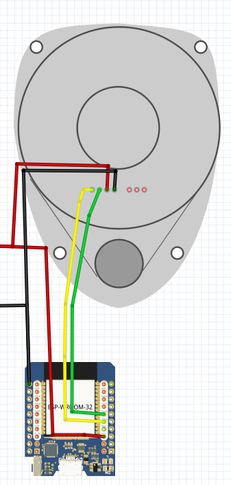

This is a fork of https://github.com/guido57/ESP32_RPLIDAR_C1_ROS.

IMPORTANT FOR SUCESSFUL BUILD:

create a file `include/credentials.h` with the following content:

```c
// credentials.h
#ifndef CREDENTIALS_H
#define CREDENTIALS_H

#include <Arduino.h>

// Wi-Fi credentials
const char *ssid = "vince"; // Replace with your actual Wi-Fi name
const char *pass = "00000000"; // Replace with your actual Wi-Fi password

// micro-ROS agent IP address and port
IPAddress ros2_agent_ipa(172, 20, 10, 10); // Replace with your actual computer IP address
const int ros2_agent_port = 8888;

#endif // CREDENTIALS_H
```

To run the agent, run (while being connected on the same WiFi network as the ESP32 board)::

```bash
docker run -it --rm --net=host microros/micro-ros-agent:humble udp4 --port 8888 -v6
```

If you don't have ros2 installed on your host machine, run (you might need to do `docker pull ros:humble` first):

```bash
docker run -it --net=host ros:humble bash
```

And then you can list the topics with:

```bash
ros2 topic list
```

which should show something like:

```
/parameter_events
/rosout
/scan
```

You can listen to the /scan topic with:

```bash
ros2 topic echo /scan
```

## Vizualisation

```bash
ros2 run rviz2 rviz2
```

Add a `LaserScan` display and set the topic to `/scan`. In global options, set frame to `laser_frame`.

# OVERVIEW

- This program demonstrates how an ESP32 can interface a SLAMTEC RPLIDAR C1 and publish /scan to ROS2 by microros at 10 Hz.

# NOTES

- I tested it only with the RPLIDAR C1 model (it's the only lidar I have :smiley: ).
- I suppose it could work with SLAMTEC S series also, as the protocols for C and S series are the same. See here: https://bucket-download.slamtec.com/c5971f2703a8d014f3925694d798ea490a370efa/LR001_SLAMTEC_rplidar_S&C%20series_protocol_v2.8_en.pdf
- I used an ESP32 D1 Mini but I'm pretty sure any ESP32 will suffice.

# SCHEMATIC

The Power Supply must be around 5.2Vcc


